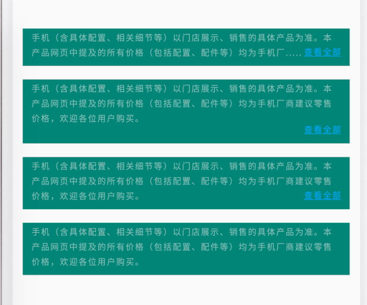

扩展`TextView`实现，当文本内容超出最大显示行数后，自动省略显示不完的部分，并在最后显示`查看全部`并可点击

### 效果图如下：   

### 使用方式
1. 图中第一种效果是当`TextView`的文本内容超出最大显示行数后，自动省略后面无法显示的内容，并在最后显示`查看全部`，中间以`...`隔开
2. 图中第二种效果显示`TextView`的全部文本，并另起一行显示`查看全部`
3. 图中第三种效果显示`TextView`的全部文本，并在最后一行填充空白直至最后显示`查看全部`
4. 图中四中效果为`TextView`的正常显示效果

> 图中`查看全部`均可以设置点击事件、颜色、是否显示下划线

### 代码具体使用方式请看示例

